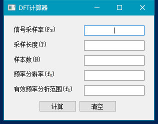

# DFT计算器

一个用来计算离散傅里叶变换相关参数的小工具，可以直接下载使用或者用Python解释器运行（Python37）。

A small tool for calculating the dft parameters. Can be used standalone or with Python interpreter (Python37).

只需在相应的框内输入参数，计算器会**自动补全**其余所有能被计算出的参数，如信号采样率(Fs)、采样长度(T)、样本数(N)或频率分辨率(f0)、有效频率分析范围(fh)（指0~fh Hz）。

All you need to do is to input parameters in the text box, then dft-calculator will **fill all other parameter automatically as long as the parameter can be calculated**. For instance, the signal sampling rate (Fs), signal time (T), number of samples (N), or frequency resolution (f0), valid frequency range (fh)(which determined by 0~fh Hz).

可以下载独立的Windows 64位版本或是Linux 64位版本的7z压缩包，可以直接运行而不用安装Python。如果希望使用Python，请确保有如下环境：

You can download the standalone zip file (.7z format) for Windows (x64) or Linux (x64), which allows you to run without installing Python. If you want to use Python, please check the requirement below:

- Python 3.7
- PyQt5